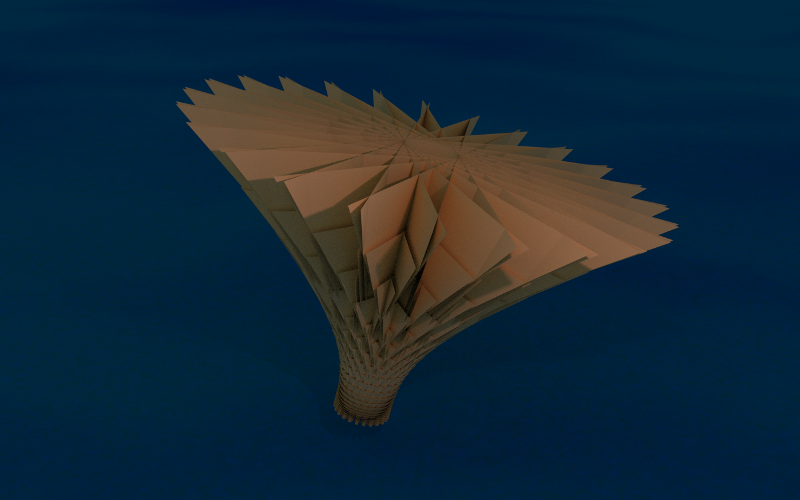
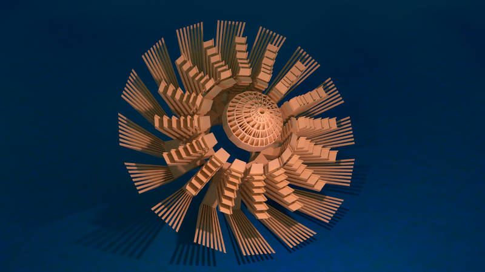

# Flowers

This program generates meshes of 3D geometrical forms and exports them in a `.ply` file.
It uses the [Morphogen library](https://github.com/thi-ng/morphogen/) by Karsten Schmidt.

## Usage

Clone this repository and `cd` in the folder. Launch the REPL `lein repl`
To export a mesh, like that one created in the `spritz` function, use `(apply save-mesh (spritz))`
A new file with `.ply` extension will be created in the main project folder.

List of available meshes:

* `spritz`
* `fake-teasel`
* `catherine-wheel`. This model also accept some options, try them out `(apply save-mesh (catherine-wheel :offset 1.3 :scale 1.2 :y-distorsion 1.2))`.If no options are provided, default values will be used.

To render them with Blender, you can follow [this tutorial](http://funprogramming.org/153-Rendering-Processing-shapes-in-Blender.html) by Abe Pazos

